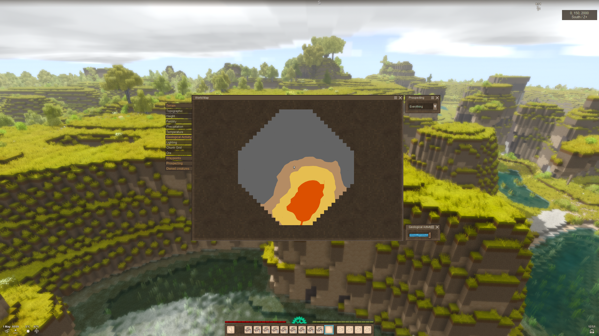
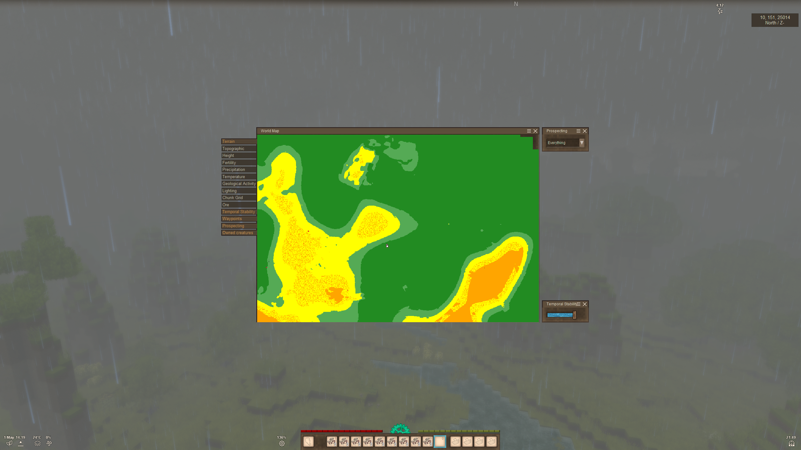

# GiMap

Ultimative map for your Vintage Story

## Modes

At now moment the mod has 9 modes


### Topographic

Surface type detection mode. Displays soil, sand, gravel, rock, and roads.


### Height

Altitude display mode. Works for both surface and underwater.


### Fertility

Displays soil fertility and is helpful when planning a garden.


### Precipitation

Displays the average annual precipitation level.


### Temperature

Displays the average annual temperature level.


### Geological activity

Displays the level of geological activity. 
Areas with high values will have geothermal vents on the surface and lava lakes underground.



### Lighting

Displays the level of artificial lighting. Useful for illuminating settlements and identifying dark areas.


### Chunk grid

Brutal chunk grid. x32, x16 and x8.


### Ore

Displays ore deposits.


### Temporal stability

Build your house so that your friend's room is in the unstable zone.



## Mix modes

Why? Yes.


## Config

You can change default config. It can be founded by path _\VintagestoryData\ModConfig\GiMapConfig.json_

All colors defined as HEX format, ex.
```json
"TopographicMode": {
    "soilColor": "#c9ea9d",
    "sandColor": "#ffffff",
    "gravelColor": "#c8c8c8",
    "stoneColor": "#969696",
    "waterColor": "#22a4ab",
    "iceColor": "#caedee",
    "snowColor": "#e6e6ff",
    "roadColor": "#323232"
  },
```

or RGBA, ex.
```json
"mountainColor": {
      "X": 255,
      "Y": 0,
      "Z": 0,
      "W": 255
    },
```

You can disable unnecessary modes. For do it change
```json
"isEnable":
```

to false

## Credits

I used [Geology Map](https://github.com/carlosganhao/VS-GeologyMap) as an example. I'm not sure if
anything from the original solution remains as this point, but I decided to mention it nonetheless.

[TemporalityMap](https://github.com/kryptokatze/TemporalityMap/)